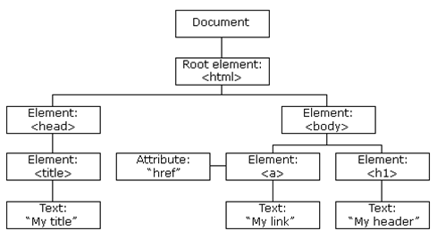

#Week 5 - Javascript   
## Day 1 - Introduction
###Lets start by doing som js
1. Set up external js document to alert()
2. React to a div being clicked
  - console.log() vs alert()
  - Inline, Internal and external js


### Some of the oddities of javascript  
[Reference here](https://www.smashingmagazine.com/2011/05/10-oddities-and-secrets-about-javascript)  
1. `alert(typeof null); //alerts 'object'`  
2. `alert(null instanceof Object); //evaluates false`  
3. `alert(typeof NaN); //alerts 'Number'`
  - `alert(NaN === NaN); //evaluates false`  
4. `alert(new Array() == false); //evaluates true`
  - every non-boolean value has a built-in boolean flag that is called on when the value is asked to behave like a boolean (Truthy or Falsy)   
5. ```var someVar = 0;   
   alert(someVar == false); //evaluates true ```   
6. ``` var someVar = 0;   
alert(someVar == false); //evaluates true – zero is a falsy    
alert(someVar === false); //evaluates false – zero is a number, not a boolean```  


### Javascript characteristics:
- is a loosely typed language
```javascript
var text = 'something here';
text = 6;
if(text){...}
```
- js has objects but not classes.
- js has a syntax similar to java
- is interpreted every time it runs
- is not compiled as a seperate step


###Data types
- number, (max 64bit)
  - Integer and floating points (NaN, infinity, -infinity)
- string, 
  - (+, \n, “typeof” operator that returns a string)
- boolean, 
- Object, 
- Function, 
- Undefined values (null and ‘undefined’)


###Truthy and Falsy
- Every non-boolean value has a built-in boolean flag
- [ ] == false
- null == false
- "" == false
- "Hello" == true
- 0 == false
- 1 == true   
[See the whole table](https://dorey.github.io/JavaScript-Equality-Table/)  
So remember to use === for comparison if it is not the boolean flag you want!!


### Operators
- Unary operators: (typeof and instanceof)
- Binary operators:
  - String Operators
  - Arithmetic Operators (+, -, *, /, %...)
  - Assignment Operators (=, +=, -=, *=, ….)
  - Logical Operators (==, ===, !==, <, >=, …)  
- Ternary operator: 
`var react = (age >= 18)? 'You are old enough to vote':'You are too young to vote'`


### Functions
- Functions and Methods (functions declared in objects).
- Functions are them selves objects
	- Objects that can be called (executed) - function objects
	- objects because functions can have properties and methods just like any object.
	- a funtion always return a value (undefined if no return statement)
	
- Declaration - 2 ways:  
```javascript
    function myFunction(){
      return "Hello from javascript";
    }
```   
and function declaration as a statement:  
```
    var myFuntion = function(){
	  return "Hello...";
    };
```
- Hoisting: 
	- Variable and function declarations are hoisted
	- Initialization is not hoisted
	- [Try removing declaration of Y here](http://www.w3schools.com/js/tryit.asp?filename=tryjs_hoisting3)
  - hoisting of functions - Only when declared as a function (not var somename = function...) 

- IIFE (immediately Invoked Function Expression)
```javascript
    (function(){ 
      return "Hello";  
    })();
```


### Function arguments
- Extra arguments are ignored
- Too few arguments and the value will be set to ”undefined”
- The 'arguements' property:
  - `arguments[0]` holds the first input parameter send to the function.
  - all function arguments are accessible through the arguments array.


### Scope
- scope is the set of variables, objects, and functions you have access to
- Javascript has function scope
	- variables declared in body of function is local to that function
	- no other code block (like conditional or loops) have local scope
- A variable declared outside a function, becomes GLOBAL
- A global variable has global scope: All scripts and functions on a web page can access it.
- If a variable is not declared (using var someVar..) it becomes a global variable
	- `myVar = 100;` If this was the first time it was mentioned - it is now a global varible no matter where it was initialized.
- Local variables are deleted when the function is completed.
- Global variables are deleted when you close the page.


### Objects
- `var myObject = {};`
- it is essentially a map or associative array (key/value pairs)
- can contain properties and methods 
```
    var person = {
      'name': 'Hans',
      'age': 41,
      'toString' : function(){
         return this.name + ' ' + this.age;
       }
    };  
```
- dot notation:
  - `person.lastName = 'Petersen';` 
- array notation
  - `person[lastname] = 'Petersen';`


### Object constructor  
- the object is declared as a function (arguments can be used to set state)
- the new operator runs the function and returns an object with properties/methods

```javascript  
var Person = function (firstName) {
  this.firstName = firstName;
  console.log('Person instantiated');
};

var person1 = new Person('Alice');
var person2 = new Person('Bob');

// Show the firstName properties of the objects
console.log('person1 is ' + person1.firstName); // logs "person1 is Alice"
console.log('person2 is ' + person2.firstName); // logs "person2 is Bob"  
```

### THIS keyword  
- In the global execution context (outside of any function), this refers to the global object "window object".
- else 'this' refers to the containing object  

```
    var Car = {
      age: 10,
      showAge: function(){ return 'this car is '+this.age+' years old'; }
    };

``` And 
```
buttons[i].onclick = function(event){
  console.log(this); //this refers to the button that was clicked
};
```


###Javascript arrays
- arrays are much like in java
- 0 indexed list of items
- js arrays can hold mixed datatypes
- `var myArray = ['one', 'two', 'three'];`
- `var myArray = new Array('one', 'two', 'three');`
- [array methods](https://developer.mozilla.org/en-US/docs/Web/JavaScript/Reference/Global_Objects/Array)

### Global namespace
- bundle variables and functions in a namespace (rather than using global variables)
- put all variables and functions in a shared object:
```
    // global namespace
    var MYAPP = MYAPP || {};
    // sub namespace
    MYAPP.event = {};
```

### Closure
- local variables only live as long as their parent function is running..WRONG
- local variables inside closures (inner functions) live on if that inner function can be accessed
- Usefull for creating private variables (like encapsulation in java)
- usefull for creating modules like this:  

```javascript  
      var counter = (function() {
	  var privateCounter = 0;
	  function changeBy(val) {
	    privateCounter += val;
	  }
	  return {
	    increment: function() {
	      changeBy(1);
	    },
	    decrement: function() {
	      changeBy(-1);
	    },
	    value: function() {
	      return privateCounter;
	    }
	  };   
	})();
```


### Callbacks
- High order functions (functions as arguments to functions)
- to be called at some later point
- callbacks are also closures (they can access the local variables of the enclosing function
- Example the array method: foreach takes a callback argument:  
```
var names = ['Peter', 'Poul', 'Palle', 'Piotr'];
names.foreach(function(eachname, index){
  console.log(index + 1 + '. '+eachname);
});
```

### Exception
- js has a throw keyword  
- js has try catch syntax

```
var validateAge = function(age){
	if(isNaN(age)){
	  throw {name: 'badAge', message: 'Invalid Age'};
	}
	if(age < 0 || age > 100){
	  throw {name: 'badAge', message: 'Age is out of range'};
	}
}
...
try{
  var age = prompt('Enter your age please');
  validateAge(age);
} catch(e){
  alert('ERROR: '+e.message);
}

```


### Javascript strict mode  
JavaScript in strict mode does not allow variables to be used if they are not declared.
- `"use strict"` put this at the top of the script (script level) or at the top of the function statements (function level)
- helps us by throwing an error when we do stupid things ;-)


### a quick look at 2 of the array methods: filter and map
- Look in the demo files for day 1.

## Exercises day 1:
[Get the daily exercise here](https://github.com/CphBusCosSem3/Exercises/blob/master/SP/SP4/Javascript%20ex%201.pdf)


##Day 2: Javascript and DOM
### DOM tree
  

### Selecting elements
- document.getElementById();
- document.getElementsByTagName()
- document.getElementsByClassName()
- document.querySelector(".myClass");
  - Returns only the first element in the element collection
- querySelector(”p.test”) / (”#container”) / (”a”)
- querySelectorAll(”p”)
  - Returns all of the elements matching. 

### The Style object
- `document.getElementById("demo").style`
- this object can be used to change styling:
- [See the list of styleobject properties](http://www.w3schools.com/jsref/dom_obj_style.asp)


### innerHTML vs. innerText

### Traversing the DOM


### Events


### Modifying DOM


### 

### 

### 

### 


## Exercise day 2: 
[Get the daily exercise here](https://github.com/CphBusCosSem3/Exercises/blob/master/SP/SP4/Javascript%20ex%202.pdf)


##Day 3: JQuery


## Exercise day 3: 
[Get the daily exercise here](https://github.com/CphBusCosSem3/Exercises/blob/master/SP/SP4/Javascript%20ex%203.pdf)


##Day 4: 


## Exercise day 4: 
[Get the daily exercise here](https://github.com/CphBusCosSem3/Exercises/blob/master/SP/SP4/Javascript%20ex%204.pdf)

